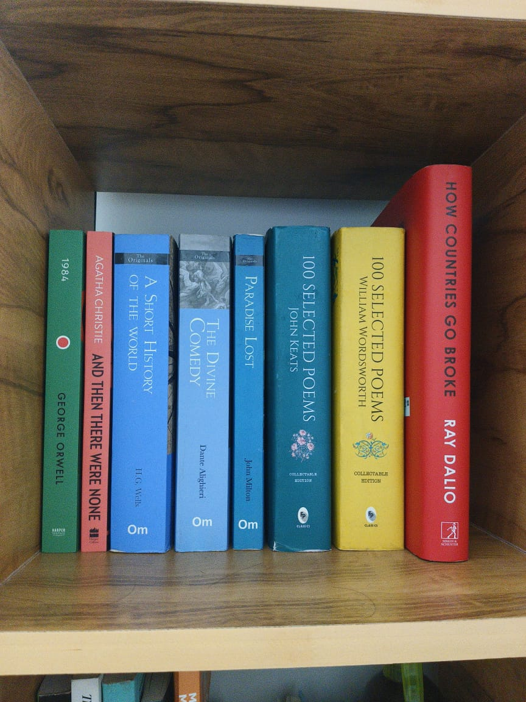

# Day 04 - Rest & Recovery

## 📅 Date
January 6, 2026

## 🛑 Status: Break Day

## Why the Break?
Too tired from gym and lack of sleep. Sometimes the best thing you can do is step back and recharge.

## 📚 What I Did Instead

### Reading
- Novels for relaxation
- Communication books for personal development

### Self-Care
- Evening ride to clear my head
- Focused on mental and physical recovery

## 💡 Key Takeaway
**Rest is part of the process.** You can't code effectively when you're burnt out. Taking care of your physical and mental health is just as important as learning.

## 📝 Notes
- Burnout is real - listen to your body
- Learning happens in different ways - reading, resting, reflecting
- Consistency doesn't mean coding every single day without breaks
- Rest days help you come back stronger

## 🔜 Tomorrow
Back to coding with a fresh mind and renewed energy!

---
**Status:** 💤 Rest Day (Productive Recovery)  
**Lesson:** Sometimes the best code you write is no code at all