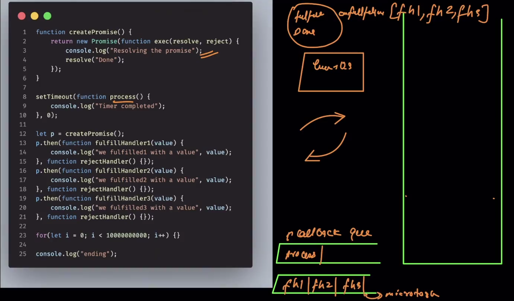

### console.log [Both Sync & Async]
    - The working of console.log maybe sync depends on what the sream it is connected to and what OS it is in.

### SetIntervals()
    - The setInterval() function in JavaScript repeatedly calls a specified function or executes a code snippet at defined time intervals, measured in milliseconds. It continues to run until it is explicitly stopped using clearInterval().

### Promises

    - Promises are Readablility Enhancers
    - they can solve the problem of inversion of control [IOC].
    - In JS, promises are special type of opjects that get returned immediately when we call them. *
    - Promises act as a placeholder[Place for the result] for the data we hope to get back sometime in future. *
    - In these promise objects, we can attach the functionality we want to execute once the future task is done.

    Once the future task is done, promises will automatically execute the attached functionality.

    in promises, u can in future attach the functionality, but in callbacks, u have to attach it on the spot with it.

``` 
x = fetch("https://abc.com")
...
...
...
here now we can use functionality, after some coding execution, whereas in callbacks we cant
```
<!-- 
- ```How they solve the problem of IOC?```
    -  -->

#### Main thigs to understand promises :
    - How we can create a promise ?
    - How can we consume a promise ?

#### There will be always two situation with promise :
    - Either we fulfill the promise
    - maybe we don't fulfill the promise. (Promise break)

---


### How to create a promise ?
    - Creation of a promise object is sync in nature. (Promise is native to JS)
    - There are 3 states of Promise objects :
        1. Fulfilled - If the operation is completed successfully.
        2. Pending - When we create a new promise object, this is the default state. It represent work in progress.
        3. Rejected - If operation was not successfull it will go in rejected state.

Syntax:
```js
new Promise(function(resolve, reject){
//inside this function we can write our time consuming task.

})
```

    - Promise() is known as constructor, this construction a callback  f with 2 parameters.
    Q. What is resolve, reject ?
        - these are like in-built function.
        - The moment the resolve() is called, the promise object will go to resolved/Fulfilled state.
        - The moment when we call reject(), the object will go to rejected state.
        - If u don't call anything, it will always/forever be in pending state.

- Promise contain state as well as value to it, so
 - if state is pending -----> Value is undefined
 - fullfilled/rejected -----> argument of resolve [resolve(x)]

 - with whatever argument we call resolve/reject with, gets assigned to the value property.


Note : *If you give more than one argument in ex: reject(num), it will always take argument 1 as the value*

.then just registers the handlers in the promise arrays. {write a little detail on this} basically it just register and move forward, they won't execute . They will just execute when the promise state changes.

---
---

# Consuming a promise :

'Attach the functionality that we need to execute once the promise is fullfiled or rejected.'
```js
// x is promise
x.then(fullfilmentHandler, rejectionHandler)
//Both are handler function,that we have to implement ourselves
```

Example:
```js

x
.then(
    function fulfillHandler(value){
        console.log("Inside Fulfill Handler with value", value);
        console.log("promise after fullfiment is..",x)
    }, 
    function rejectionHandler(value){
        console.log("Inside rejected Handler with value", value);
        console.log("promise after rejection is..",x);
    }
)
```

---
---

# Micro Tasks :

- So the handlers move to micro task, when the state is triggered. they(p.then) will sit tight in the micro task.

##### See microTask.js file for the workflow and understanding.
    - At any point of time, if event loop has a choice to pick from micro-task queue or callback queue(Macro-task queue), then it always give preference to micro-task queue.
    
